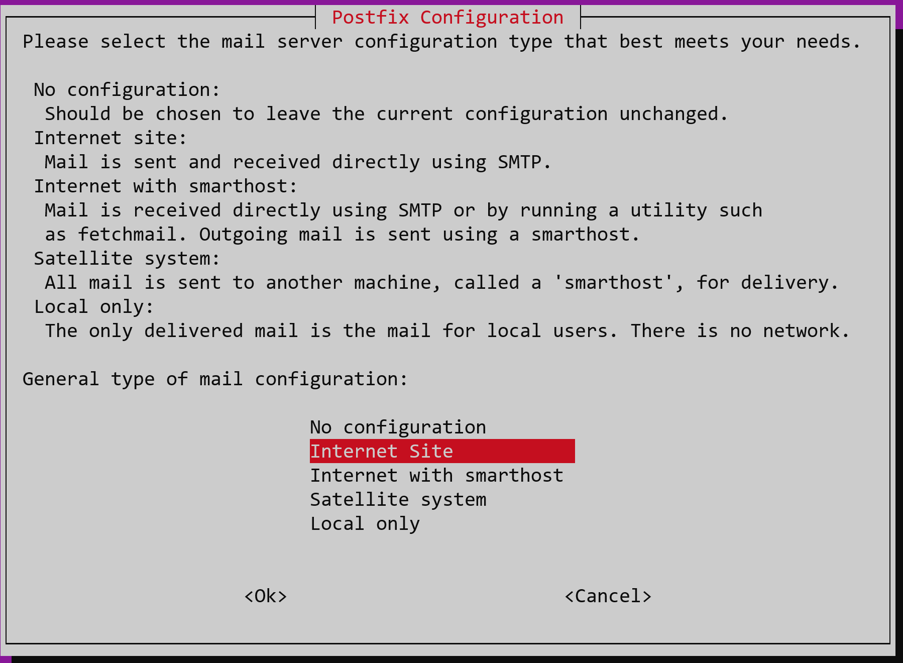

# Installing Jenkins and GitLab
How to installing Jenkins and GitLab on the same Server

## Instaling GitLab


Install necessary dependencies

```
sudo apt-get update
sudo apt-get install -y curl openssh-server ca-certificates tzdata perl
```

Install Postix
 
```
sudo apt-get install -y postfix
```



Downlod install script

```
wget https://packages.gitlab.com/install/repositories/gitlab/gitlab-ee/script.deb.sh
```

Run install script

```
sudo bash script.deb.sh
```

Set external URL and install GitLab

```
sudo EXTERNAL_URL="https://[IP / Domain]" apt-get install gitlab-ee
```

Stop GitLap

```
sudo gitlab-ctl stop
```

Edit config

```
sudo nano /etc/gitlab/gitlab.rb
```

Change port 8080 to 8081

- `gitlab_workhorse['auth_backend'] = "http://localhost:8081"`
- `unicorn['worker_timeout'] = 60`
- `unicorn['worker_processes'] = 2`
- `unicorn['port'] = 8081`

Reconfig GitLab

```
sudo gitlab-ctl reconfigure
```

Restart GitLab

```
sudo gitlab-ctl restart
```


## Openjdk

To find the current Javer version, first search for `openjdk`. Then select the current version.

```
sudo apt search openjdk
```

Install Java

```
sudo apt install openjdk-[Version]-jdk -y
```

## Jenkins

Add public jenkins key

```
wget -q -O - https://pkg.jenkins.io/debian-stable/jenkins.io.key | sudo apt-key add -
```

Add Jenken to paketmanager

```
sudo sh -c 'echo deb https://pkg.jenkins.io/debian-stable binary/ > \
    /etc/apt/sources.list.d/jenkins.list'
```

Update packet list to find Jenkins

```
sudo apt-get update
```

Install Jenkins on server

```
sudo apt-get install jenkins -y
```

Find password

```
sudo nano /var/lib/jenkins/secrets/initialAdminPassword
```


# Links
## Jenkins
- [Jenkins](https://www.jenkins.io/)
- [Linux - Jenkins](https://www.jenkins.io/doc/book/installing/linux/)

## GitLab
- [GitLab](https://about.gitlab.com/)
- [Recommended installation](https://about.gitlab.com/install/#ubuntu)
- [Configuration options](https://docs.gitlab.com/omnibus/settings/configuration.html)
